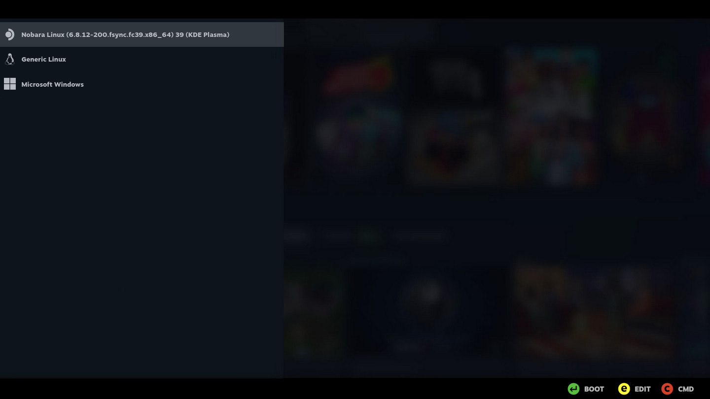

# Steam Big Picture Grub Theme

A theme inspired by [Steam Big Picture Mode](https://static1.makeuseofimages.com/wordpress/wp-content/uploads/2023/08/big-picture-mode-settings.jpg)



## Supported resolutions

- 2560x1600
- 2560x1440
- 1920x1080
- 1280x800

## Installation

`<resolution>` is your screen resolution

- Copy `dist/steam-big-picture-<resolution>` to `/boot/grub2/themes/steam-big-picture-<resolution>`
- Edit `/etc/default/grub`:

  ```txt
  GRUB_THEME='/boot/grub2/themes/steam-big-picture-<resolution>/theme.txt'
  GRUB_BACKGROUND='/boot/grub2/themes/steam-big-picture-<resolution>/background.png'

  # Set the resolution
  GRUB_GFXMODE='<resolution>'

  # Comment out GRUB_TERMINAL_OUTPUT if console
  # GRUB_TERMINAL_OUTPUT='console'
  ```

- Update grub

  ```sh
  sudo update-grub
  ```

## Credits

- [vinceliuice's grub2-themes](https://github.com/vinceliuice/grub2-themes)

## Misc

- [GRUB2 Tutorial](https://web.archive.org/web/20240627031010/https://wiki.rosalab.ru/en/index.php/Grub2_theme_tutorial)

## FAQ

- **Will it work on Steam Deck?**

  No, stock SteamOS doesn't display a grub menu.

- **What about Bazzite, ChimeraOS, HoloISO?**

  Messing around with immutable distributions is not advisable.

- **Can it work on my distro?**

  This theme works on any mutable distribution that uses GRUB2 bootloader, such as Nobara. 

- **My resolution isn't supported!**

  I can only test this theme on my laptop (2560x1600), the other resolutions are only guesstimates. PRs are welcome!
  
- **This theme is bad / wrong!**

  I am not a designer. This is my first GRUB theme ever. Move along.
